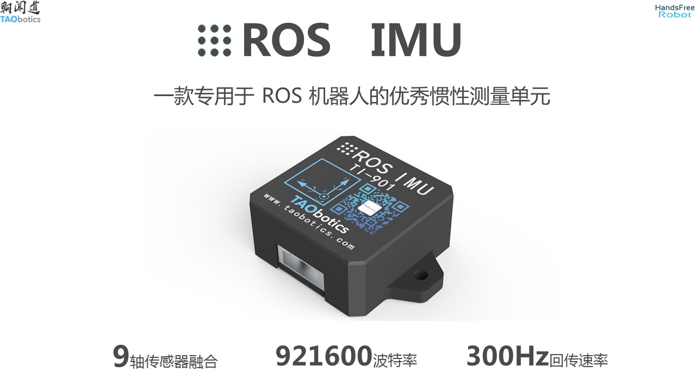
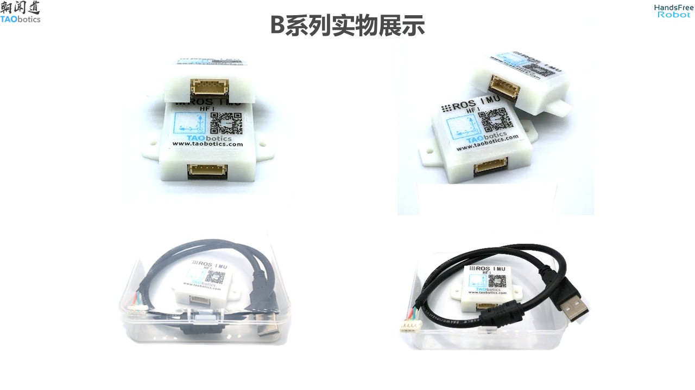
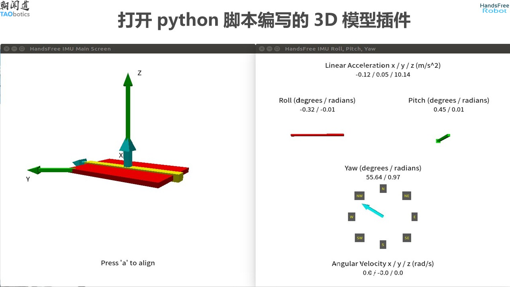
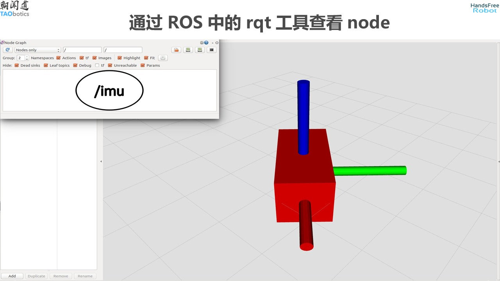
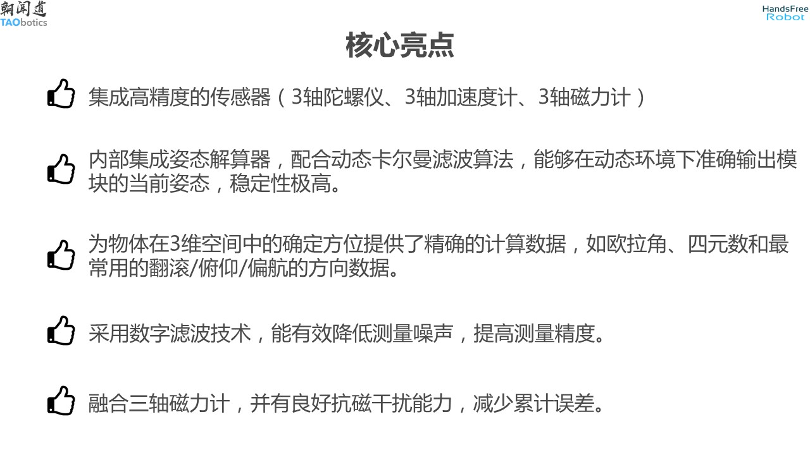
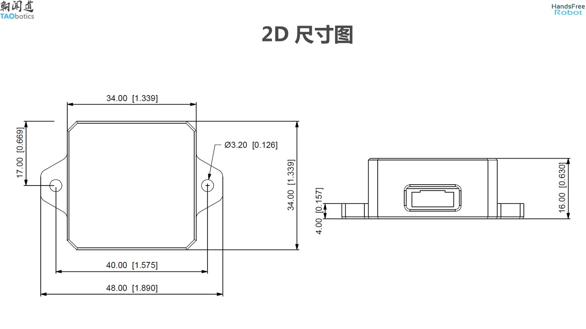
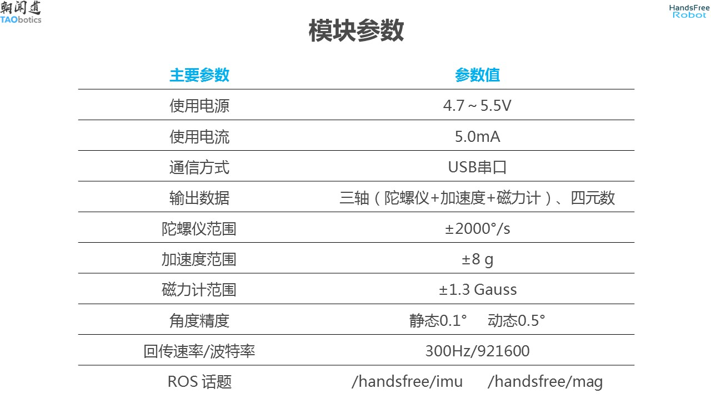
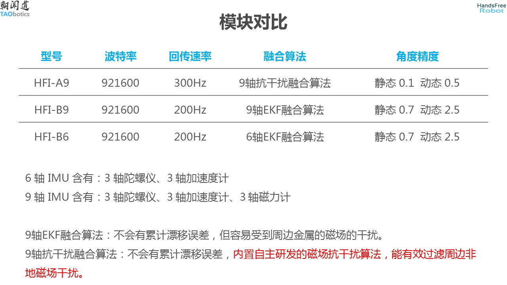
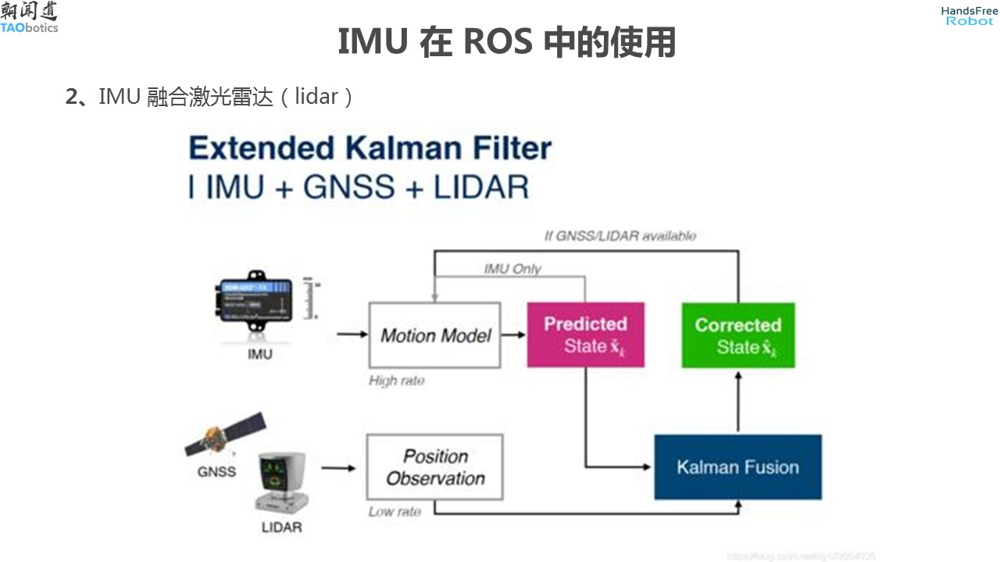

# HandsFree ROS IMU User Manual

handsfree_ros_imu is a ROS function package for learning to use IMU. It is suitable for 3 ROS IMUs launched by handsfree. It also contains output data display written in pure python, supporting Linux, Windows and other related script files.

rostopic：
* Topics posted by Gyroscopes and Accelerometers: /handsfree/imu
* Topics posted by Magnetometer: /handsfree/mag

HandsFree ROS IMU Purchase links
[Taobao](https://item.taobao.com/item.htm?id=634027133148&ali_trackid=2:mm_26632258_3504122_32538762:1607955215_176_1820526432&union_lens=lensId:OPT@1607955206@212a8363_06ed_1766199523e_c878@01;recoveryid:201_11.27.58.136_21013517_1607955156105;prepvid:201_11.87.178.209_21008506_1607955206099&clk1=3e91f5613ddee8ba055d43c0368cfc9b&spm=a2e0b.20350158.31919782.18&pvid=100_11.182.77.179_11449_6761607955206647512&scm=null&bxsign=tbkozY1fyN0hsF81R/xTfHbTs5netRJ2MylEoFSlUg/Ds4QInP5TK8iioSmX2JM66JbK2KXA4JwODRwz0JptZUNTK3pfqvfvE6ObkDSU+tV8o4=)
[Aliexpress](https://aliexpress.ru/item/1005006722373728.html?sku_id=12000038092496936)

## Tutorial documentation

[ Selection Introduction ](./tutorials/imu_user_manual/02_选型介绍/doc.md): Contains basic knowledge of IMU, common selection issues, purchasing information, etc.

[ Supporting Software Package Installation ](./tutorials/imu_user_manual/03_基础教程/01_配套软件包安装/doc.md): Contains usage under windows, Linux and Linux + ROS.

[ Python Driver Test ](./tutorials/imu_user_manual/03_基础教程/02_Python驱动测试/doc.md): Contains basic knowledge of IMU, common selection questions, purchasing information, etc.

[ ROS-Driven Testing and Visualization ](./tutorials/imu_user_manual/03_基础教程/03_ROS驱动和可视化/doc.md): ROS Drive testing and visualization

[ Odometer and IMU Fusion ](./tutorials/imu_user_manual/04_高级教程/01_里程计和IMU融合/doc.md): Taking A9 as an example of odometer and IMU integration

[ GPS and IMU Fusion ](./tutorials/imu_user_manual/04_高级教程/02_GPS和IMU融合/doc.md): GPS and IMU fusion taking A9 as an example

[ Laser SLAM and IMU Fusion ](./tutorials/imu_user_manual/04_高级教程/03_激光SLAM和IMU融合/doc.md): Laser SLAM and IMU fusion using A9 as an example

[ Visual SLAM and IMU Fusion ](./tutorials/imu_user_manual/04_高级教程/04_视觉SLAM和IMU融合/doc.md): Fusion of visual SLAM and IMU using A9 as an example

[ Questions and Answers ](./tutorials/imu_user_manual/05_问题和答疑/doc.md): Contains question summary, how to ask, knowledge base and reference links

[ Appendix-Serial Port Assistant Test Communication ](./tutorials/imu_user_manual/06_附录/01_串口助手测试通讯/doc.md): Use serial port assistant to test communication

---

## product description

There are accelerometers, gyroscopes, and magnetometers in the IMU. By fixing the imu to the object, you can obtain some information about the object during its movement, such as the object's three-axis acceleration information, three-axis angular velocity information, and three-axis angle information. , three-axis magnetic field information. Through this information, the state of the object during motion can be known.

IMU design has a wide range of applications and plays an important role in military aerospace, navigation, military, medical, entertainment, robotics, vehicles and other fields.

### model

There are 3 product models in total:

* A9: Three-axis acceleration information, three-axis angular velocity information, three-axis angle information, and three-axis magnetic field information can be obtained.
* B9: Three-axis acceleration information, three-axis angular velocity information, three-axis angle information, and three-axis magnetic field information can be obtained.
* B6：Three-axis acceleration information, three-axis angular velocity information, and three-axis angle information can be obtained.

### introduce

