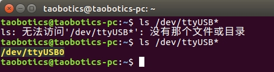

# Python 驱动测试
## windows 下测试
以 win7，a9，python2.7 为例，测试 `hif_a9.py` 和 `hif_a9_ui.py`

1. 插上 IMU 的 USB 设备，检查电脑能否识别到 `Silicon Labs CP210x USB to UART Bridge（COM*）`\* 指任意数字。如果有多个 `Silicon Labs CP210x USB to UART Bridge（COM*）` 请重新拔出一下 IMU 的 USB，记一下 IMU 被电脑识别到的 COM 口是多少。

   

2. 进入脚本目录，修改对应的 python 脚本中 COM3（脚本默认用的 COM3） 为你电脑识别出来的数字

   

3. win+R 打开一个标题为运行的窗口，在输入框输入 cmd，回车后出现的命令字符界面（一开始通过该字符界面运行可以看到为运行后的报错，方便根据报错提示来安装缺少的依赖或排查未运行成功的原因）。通过 `cd` 命令前往脚本所在目录，然后通过 `python` 命令来运行脚本文件。下图为 hfi_a9.py 驱动运行成功后的截图，运行成功后正常情况会不停打印以下信息。

   

4. 同理，下图 hfi_a9_ui.py 运行成功后的截图。标题为 handsfree imu 的窗口，里面的数据将会打印出来。 

   

## linux 下测试

以 ubuntu16.04，a9，python2.7 为例，测试 `hif_a9.py` 和 `hif_a9_ui.py`

1. 先不要插 IMU 的 USB ，在终端输入 `ls  /dev/ttyUSB*` 来检测一下，然后在将 USB 插入电脑，再在终端输入 `ls  /dev/ttyUSB*` 来检测一下，多出来的 ttyUSB 设备就是 IMU 的串口。

   

2. 进入脚本目录，修改对应的 python 脚本中 /dev/ttyUSB0（脚本默认用的 /dev/ttyUSB0） 为你电脑识别出来的数字

   

3. 可通过 `cd` 命令到脚本所在的目录，也可以在脚本所在的目录打开终端，然后通过 `python` 命令运行脚本。下图为 hfi_a9.py 驱动运行成功后的截图。

   

4. 同理，下图 hfi_a9_ui.py 运行成功后的截图。标题为 handsfree imu 的窗口，里面的数据将会打印出来。 

   
