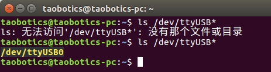
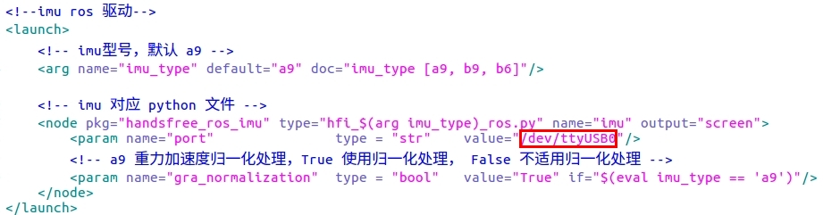
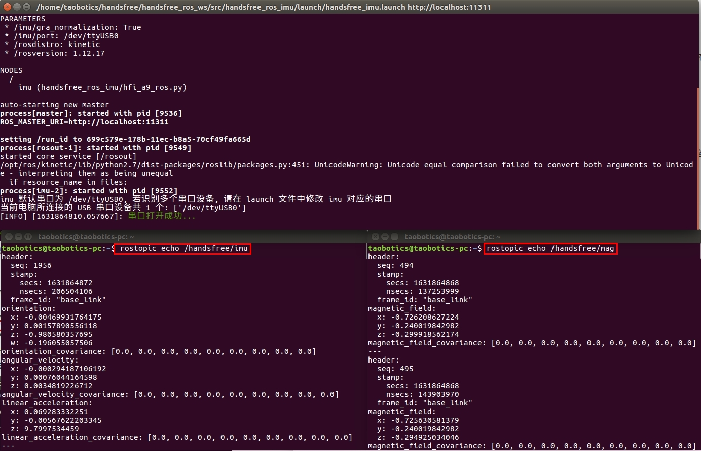

# ROS 驱动和可视化

以 ubuntu16.04，a9，python2.7 为例

1. 先不要插 IMU 的 USB ，在终端输入 `ls  /dev/ttyUSB*` 来检测一下，然后在将 USB 插入电脑，再在终端输入 `ls  /dev/ttyUSB*` 来检测一下，多出来的 ttyUSB 设备就是 IMU 的串口。

   

2. 进入脚本目录，修改对应的 launch 文件中的 /dev/ttyUSB0（脚本默认用的 /dev/ttyUSB0）为你电脑识别出来的数字

   

3. 打开终端，运行 imu 驱动， `imu_type:=*`\* 为对应的型号，可选择有[a9, b9, b6]

   ```
   roslaunch handsfree_ros_imu handsfree_imu.launch imu_type:=a9
   ```

   打开两个新终端输入分别输入下面两行命令

   ```
   rostopic echo /handsfree/imu
   rostopic echo /handsfree/mag
   ```

   如下图，驱动运行成功后和 `rostop echo` 输出的信息

   

4. 同理，如需要运行其他 launch 文件，需要先确保 launch 文件中的 /dev/ttyUSB 设备修改对。

5. 相关文件说明

   * display_and_imu.launch，打开打开 IMU 驱动节点和用 visual 编写的可视化模型。（仅支持 ubuntu 16.04）
   * handsfree_imu.launch，打开用 IMU 驱动节点。
   * rviz_and_imu.launch，打开 IMU 驱动节点和 Rviz 可视化。
   * view_display .launch，单独打开用 visual 编写的可视化模型。
   * view_rviz.launch，单独打开Rviz 可视化。

